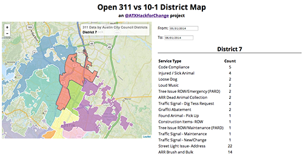

#311 vs 10ONE
##311 data plotted by Austin City Council Districts
###link: <http://mateoclarke.github.io/311vs10One/>
####An @atxhackforchange project

Contributions from:

* Mateo Clarke [@mateoclarke](https://github.com/mateoclarke) (Project Champion)
* Michael Quinn (City of Austin: 311)
* Jedd Fenner [@jeddf](https://github.com/jeddf)
* Adrian Laurenzi [@alaurenz](https://github.com/alaurenz) (Socrata)
* Luqmaan Dawoodjee [@luqmaan](https://github.com/luqmann)
* Chip Rosenthal [@chip-rosenthal](https://github.com/chip-rosenthal) (Open Austin)
* Eric McGregor [@ericmcgregor](https://github.com/ericmcgregor)

Resources:

Intro to Leaflet: <http://jseppi.github.io/geojam-leaflet-pres/#(1)>
